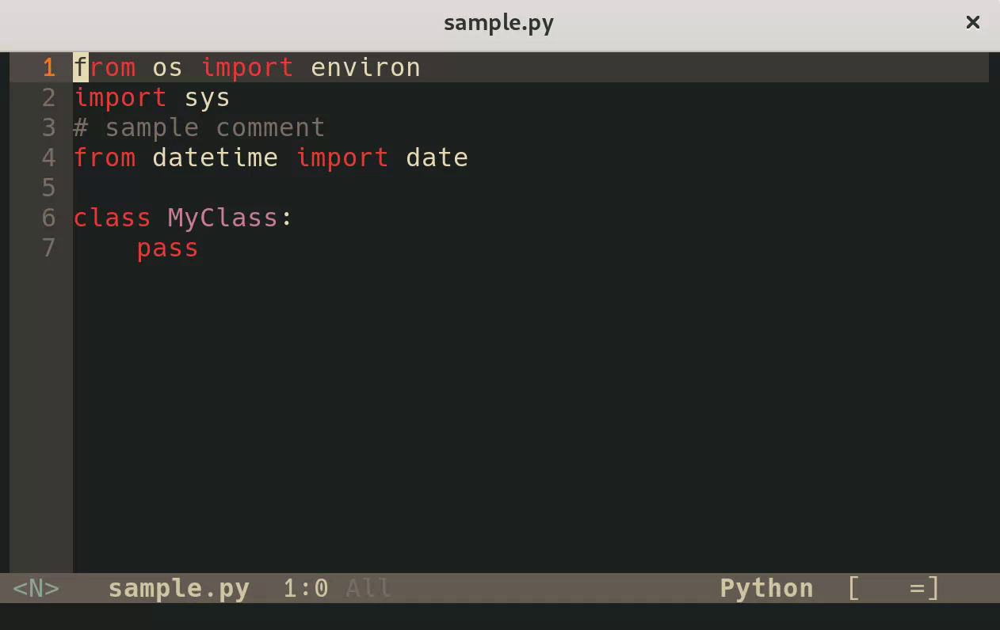

# hide-imports-mode

`hide-imports-mode` is a minor mode for Emacs that helps reduce visual clutter by hiding import statements in your code.

## Features

- Hides import statements in supported major modes:
    - Elixir
    - Python
    - Rust
- Automatically shows imports when your cursor is within the import region.
- Configurable auto-hide timer that hides imports after a delay when cursor exits the region.
- Independent timers for multiple import blocks - each region hides after its own delay.
- Provides a toggle function to manually show/hide imports.

## Installation

### Manual Installation

1.  Download the `hide-imports-mode.el` file.
2.  Place it in your Emacs `load-path`.
3.  Add the following to your Emacs configuration (`init.el` or `~/.emacs`):

    ```emacs-lisp
    (add-to-list 'load-path "/path/to/hide-imports-mode/") ;; Replace with actual path
    (require 'hide-imports-mode)
    ```

### Using a Package Manager

Using `use-package` and `:vc`:

```emacs-lisp
(use-package hide-imports-mode
  :vc (:fetcher github :repo "dallagi/hide-imports-mode")
  :config
  (hide-imports-global-mode 1))
```

## Demo



## Usage

### Enabling the Mode

-   **Globally:** To enable `hide-imports-mode` automatically in supported major modes, add this to your Emacs config:
    ```emacs-lisp
    (hide-imports-global-mode 1)
    ```
-   **Per-buffer:** To enable it manually in the current buffer:
    ```emacs-lisp
    M-x hide-imports-mode
    ```

### Toggling Imports

-   Use `M-x hide-imports-toggle` or the keybinding `C-c C-i` (if enabled) to manually show or hide imports.
-   Imports will automatically reappear when your cursor enters the hidden import region.
-   When you move the cursor out of an import region, it will remain visible for the configured delay period before automatically hiding.
-   Multiple import regions can have independent timers - you can quickly scroll through all import blocks to reveal them, and each will hide after its own delay.

### Auto-Hide Timer Behavior

The auto-hide timer provides a more natural editing experience by giving you time to read or work with imports before they disappear:

- **Per-region timers**: Each import block has its own independent timer
- **Timer activation**: When you move the cursor out of an import region, a timer starts for that specific region
- **Timer cancellation**: Moving the cursor back into a region cancels only that region's timer
- **Multiple concurrent timers**: You can quickly scroll through multiple import blocks to reveal them all, and each will hide after its own delay
- **Movement outside imports**: Moving the cursor between different positions outside import regions does not cancel existing timers
- **Configurable delay**: The delay is fully customizable and can be disabled entirely

#### Usage Examples:

1. **Quick review**: Navigate to imports, read them for 1 second, then move away - they'll hide automatically
2. **Fast browsing**: Quickly scroll through all import blocks to see what's imported, then continue coding - all blocks will hide after their individual delays
3. **Focused editing**: When working in import regions, move between them freely without premature hiding

## Configuration

-   `hide-imports-replacement-text`: Customize the text displayed when imports are hidden (default: "Imports...").
    ```emacs-lisp
    (setq hide-imports-replacement-text "...")
    ```
-   `hide-imports-minimum-rows`: Minimum number of rows required to hide imports (default: 3). If the import region contains fewer rows than this value, imports will remain visible.
    ```emacs-lisp
    ;; Hide imports only if there are 5+ rows
    (setq hide-imports-minimum-rows 5)

    ;; Hide all imports, even single lines
    (setq hide-imports-minimum-rows 1)
    ```
-   `hide-imports-hide-all-blocks`: When non-nil, hide all contiguous import blocks instead of only the first one (default: nil). Each contiguous block of imports/comments must meet the minimum-rows threshold to be hidden.
    ```emacs-lisp
    ;; Hide all import blocks throughout the file
    (setq hide-imports-hide-all-blocks t)

    ;; Hide only the first import block (default behavior)
    (setq hide-imports-hide-all-blocks nil)
    ```
-   `hide-imports-auto-hide-delay`: Delay in seconds before automatically hiding imports when cursor exits the region (default: 1.0). Set to 0 to disable auto-hide functionality and return to immediate hiding.
    ```emacs-lisp
    ;; Hide imports after 2 seconds
    (setq hide-imports-auto-hide-delay 2.0)

    ;; Disable auto-hide timer (immediate hiding)
    (setq hide-imports-auto-hide-delay 0)

    ;; Very short delay for quick coding
    (setq hide-imports-auto-hide-delay 0.5)
    ```
-   `hide-imports-global-modes`: A list of major modes where `hide-imports-global-mode` should activate `hide-imports-mode`.
    ```emacs-lisp
    (setq hide-imports-global-modes '(python-mode python-ts-mode rust-mode))
    ```
-   `hide-imports-refresh-delay`: Delay in seconds before refreshing import regions after buffer changes (default: 0.5). This prevents constant recalculation while typing. Set to 0 for immediate refresh.
    ```emacs-lisp
    ;; Refresh after 1 second of inactivity
    (setq hide-imports-refresh-delay 1.0)

    ;; Immediate refresh (may impact performance)
    (setq hide-imports-refresh-delay 0)
    ```
